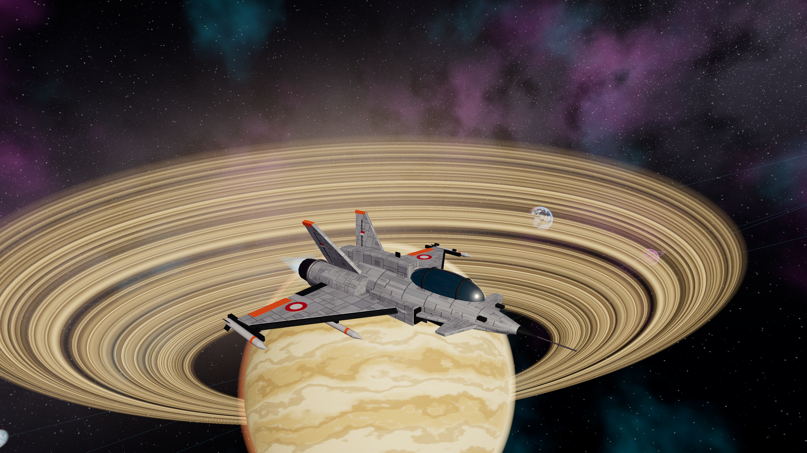

# Jelajah Antariksa

Game web 3D eksplorasi luar angkasa dalam **satu file HTML**. Kemudikan pesawat, dekati planet-planet eksotis, dan jelajahi sistem bintang Surya tanpa batas waktu — langsung dari browser, tanpa unduhan aset.



## Menjalankan

Buka `jelajah-antariksa.html` langsung di browser modern (Chrome, Edge, Firefox, Safari), atau sajikan lewat server statis:

```bash
python3 -m http.server 8765
```

lalu buka `http://localhost:8765/jelajah-antariksa.html`. Butuh koneksi internet untuk memuat Three.js (r186) dan font dari CDN.

## Fitur

- **Sistem bintang prosedural** — matahari Surya, 8 planet, 3 bulan, sabuk asteroid, nebula dan bintang. Semua permukaan planet dibuat lewat shader (tanpa tekstur), detail bertambah saat didekati.
- **3 pesawat detail** — Rajawali (pencegat), Kelana (penjelajah dengan cincin habitat berputar), Pari (sayap terbang manta). Tekstur panel lambung, decal, dan lampu dibuat prosedural.
- **HUD navigasi** — kompas arah, radar, kecepatan, koordinat X/Y/Z, planet terdekat, target navigasi dengan estimasi waktu tiba, jurnal penemuan.
- **Pandangan bebas** — putar kamera mengelilingi pesawat tanpa mengubah arah terbang.
- **Simpan otomatis** — posisi dan jurnal disimpan di `localStorage` (`gameState`, `playerSettings`); lanjutkan petualangan kapan saja tanpa akun.
- **Desktop & mobile** — keyboard/mouse dengan pointer lock, atau kontrol sentuh (joystick, tuas dorongan, tombol aksi).

## Kontrol

| Aksi | Keyboard & mouse | Layar sentuh |
|---|---|---|
| Dorong maju / mundur | `W` / `S`, roda mouse | Tuas kanan |
| Kemudi | Mouse, `↑` `↓` `A` `D` | Geser sisi kiri |
| Guling | `Q` / `E` | ⟲ ⟳ |
| Naik / turun | `Space` / `C` | ▲ ▼ |
| Boost | `Shift` | BOOST |
| Ganti target / arahkan | `T` / tahan `G` | ⌖ / tahan ◎ |
| Pandangan bebas | Tahan klik kanan atau `L` (roda = zoom) | Geser area kosong |
| Kamera kokpit | `V` | Tombol kamera |
| Jurnal / jeda | `J` / `Esc` | Tombol jeda |

## Teknologi

HTML5, CSS3, Vanilla JavaScript (ES modules), [Three.js](https://threejs.org) via import map, Web Audio API untuk suara sintetis. Tanpa build step, tanpa backend.

Spesifikasi awal: [jelajah-antariksa-PRD (1).md](<jelajah-antariksa-PRD (1).md>).
