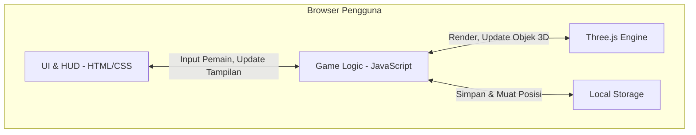

# PRD — Project Requirements Document

## 1. Overview
Aplikasi ini adalah sebuah game web 3D bertema penjelajahan luar angkasa yang dirancang khusus untuk para pemain game (gamers) yang menyukai kebebasan dalam bereksplorasi. Masalah yang diselesaikan aplikasi ini adalah memberikan akses mudah dan cepat untuk menikmati petualangan ruang angkasa langsung dari browser web, tanpa perlu mengunduh file game yang berat. Tujuan utama dari game ini adalah memberikan sensasi mengemudikan pesawat luar angkasa secara bebas, melihat planet-planet eksotis dari jarak dekat, dan menikmati keindahan luar angkasa tanpa tekanan atau batasan waktu.

## 2. Requirements
- **Aksesibilitas Browser:** Game harus dapat berjalan lancar di browser web modern (desktop dan mobile) menggunakan teknologi WebGL tanpa lag yang mengganggu.
- **Performa 3D Ringan:** Model planet, ruang angkasa, dan pesawat harus dioptimalkan agar waktu pemuatan (loading) cepat dan tidak membebani perangkat pengguna.
- **Kendali Responsif:** Sistem input (keyboard/mouse untuk desktop, atau layar sentuh untuk mobile) harus disesuaikan agar terasa natural saat mengendalikan pesawat terbang dalam ruang 3D.
- **Penyimpanan Data Lokal:** Sistem menggunakan browser localStorage untuk menyimpan otomatis posisi pesawat pemain secara lokal tanpa memerlukan server atau database luar, sehingga pemain dapat melanjutkan penjelajahan dari posisi terakhir.

## 3. Core Features
Fitur-fitur ini disusun berdasarkan fase pengembangan untuk memastikan perilisan yang terstruktur.

**Fase 1: Dasar Eksplorasi**
- **Ruang Penjelajahan** [high] — Area utama di mana pemain dapat menjelajahi luar angkasa luas secara bebas dan melihat planet-planet.
  - Luar Angkasa Terbuka: Area luas untuk terbang bebas ke segala arah, melihat bintang, nebula, dan objek langit.
  - Koleksi Planet: Beberapa planet dengan tampilan dan ukuran berbeda yang bisa didekati dan dilihat dari dekat.
  - Lingkungan 3D Sederhana: Lingkungan 3D sederhana yang mudah dimuat dan dijelajahi langsung dari browser.
- **Kendali Pesawat** [high] — Pesawat luar angkasa yang bisa dikendalikan pemain untuk terbang dan mendekati planet.
  - Terbangkan ke Segala Arah: Pemain dapat mengarahkan pesawat ke atas, bawah, kiri, kanan, maju, dan mundur.
  - Dekati Planet: Kemampuan untuk terbang mendekati planet dan melihat detail permukaannya.
  - Indikator Kecepatan: Tampilan yang menunjukkan seberapa cepat pesawat bergerak di ruang angkasa.

**Fase 2: Antarmuka & Navigasi**
- **Tampilan HUD** [medium] — Informasi penting yang ditampilkan di layar saat bermain, seperti informasi navigasi dan posisi.
  - Nama Planet Terdekat: Label yang muncul saat pesawat mendekati planet, menunjukkan nama dan jaraknya.
  - Indikator Kecepatan: Tampilan kecepatan pesawat saat ini dalam satuan yang mudah dipahami.
  - Koordinat Posisi: Menampilkan koordinat X, Y, Z posisi pesawat di ruang angkasa untuk orientasi pemain.
  - Kompas Arah: Indikator arah hadap pesawat untuk membantu navigasi di ruang 3D.

**Fase 3: Personalisasi & Simpan Progres**
- **Pesawat Pribadi** [low] — Pengaturan ringan untuk pesawat pemain yang disimpan di localStorage.
  - Pilihan Bentuk Pesawat: Pilih tampilan visual pesawat dari beberapa pilihan yang tersedia, preferensi disimpan secara lokal di browser.
- **Simpan & Lanjutkan** [low] — Kemampuan menyimpan posisi penjelajahan secara otomatis ke localStorage agar pemain bisa melanjutkan penjelajahan kapan saja tanpa perlu akun atau login.
  - Simpan Posisi Otomatis: Menyimpan posisi pesawat secara otomatis ke localStorage saat pemain keluar, menutup tab, atau ketika game mencapai titik penyimpanan tertentu.
  - Lanjutkan Petualangan: Memuat kembali posisi terakhir dari localStorage agar pemain dapat langsung melanjutkan penjelajahan tanpa kehilangan progres.

## 4. User Flow
1. **Mulai & Eksplorasi Awal:** Pengguna membuka halaman web game, memilih bentuk pesawat (jika sudah tersedia, Fase 3), dan langsung ditempatkan di Luar Angkasa Terbuka.
2. **Kendalikan Pesawat:** Pengguna mulai menerbangkan pesawat ke segala arah, mengamati Indikator Kecepatan, Koordinat Posisi, dan Kompas Arah untuk bernavigasi (Fase 1 dan Fase 2).
3. **Jelajahi Planet:** Pengguna terbang mendekati Koleksi Planet untuk melihat detail secara langsung. Saat mendekati planet, Nama Planet Terdekat muncul di HUD menunjukkan nama dan jarak planet tersebut (Fase 1 dan Fase 2).
4. **Eksplorasi Berkelanjutan:** Pengguna bebas menjelajahi area Luar Angkasa Terbuka tanpa batasan waktu atau target, menikmati pemandangan bintang, nebula, dan planet-planet sesuai keinginan.
5. **Simpan dan Keluar:** Sistem "Simpan Posisi Otomatis" terus bekerja di balik layar, menulis data koordinat pesawat ke localStorage secara periodik atau saat event tertentu. Saat pengguna menutup browser dan kembali bermain besok, game mendeteksi data tersimpan dan menawarkan opsi "Lanjutkan Petualangan" untuk mengembalikan posisi terakhir (Fase 3).

## 5. Architecture
Aplikasi ini sepenuhnya berjalan di sisi klien (client-side) sebagai Single Page Application (SPA) tanpa backend atau database eksternal. Semua logika game, rendering 3D, dan penyimpanan data ditangani langsung di browser menggunakan teknologi Web.



Penjelasan:
- **UI & HUD**: Dibangun dengan HTML dan CSS, menampilkan menu, informasi navigasi, koordinat, kompas, dan indikator kecepatan.
- **Three.js Engine**: Bertanggung jawab merender ruang angkasa, planet, pesawat, serta menangani kamera dan pencahayaan menggunakan WebGL.
- **Game Logic (JavaScript)**: Mengelola mekanika permainan, pergerakan pesawat, pengecekan jarak ke planet, serta jembatan antara UI dan Engine.
- **Local Storage**: Menyimpan data posisi pesawat dan preferensi pemain. Data dibaca saat game dimulai untuk melanjutkan sesi sebelumnya.

## 6. Local Storage Schema
Untuk menyimpan data permainan secara lokal tanpa database server, digunakan objek terstruktur yang disimpan di bawah satu atau beberapa kunci di localStorage. Berikut skema data yang akan dipakai:

| Kunci localStorage | Tipe Data | Deskripsi |
|-------------------|-----------|-----------|
| `gameState`       | Object JSON | Menyimpan snapshot posisi pesawat terkini. |
| `playerSettings`  | Object JSON | Preferensi pemain (bentuk pesawat, volume, dll). |

**Struktur `gameState`**:
```json
{
  "position": { "x": 0, "y": 0, "z": 0 },
  "rotation": { "x": 0, "y": 0, "z": 0 },
  "lastSaved": "2025-03-15T10:30:00Z"
}
```

**Struktur `playerSettings`**:
```json
{
  "selectedShip": "ship_01",
  "soundEnabled": true,
  "hudOpacity": 0.8
}
```

Semua operasi baca/tulis dilakukan secara sinkron (karena localStorage bersifat blocking) saat game dimulai, saat terjadi perubahan data penting, dan saat pemain keluar. Data tidak dienkripsi, hanya untuk kenyamanan pengguna pada perangkat lokal yang sama.

## 7. Tech Stack
Berdasarkan pendekatan pengembangan web statis murni yang memanfaatkan kemampuan browser modern untuk grafis 3D, berikut struktur teknologinya:
- **Teknologi Dasar:** HTML5, CSS3, dan Vanilla JavaScript (ES6+) — Digunakan untuk membangun antarmuka pengguna, logika game, dan mengelola interaksi secara langsung tanpa framework tambahan.
- **3D Engine:** Three.js — Library JavaScript untuk merender dan mengelola objek 3D di atas WebGL. Diimpor melalui CDN (misal dari unpkg atau jsdelivr) agar tetap ringan dan tanpa langkah build.
- **Styling HUD & UI:** CSS custom (dapat menggunakan CSS Grid, Flexbox, dan variabel CSS) untuk menata menu, indikator kecepatan, koordinat, kompas, dan informasi navigasi agar responsif dan modern.
- **Penyimpanan Data:** Browser LocalStorage — Digunakan untuk menyimpan posisi pesawat dan preferensi pengguna secara persisten di sisi klien.
- **Deployment:** Hosting statis (contoh: GitHub Pages, Netlify, atau Vercel dengan pengaturan static) — Cukup mengunggah file HTML, CSS, JS, dan aset 3D (glTF/glb) ke server statis; tidak memerlukan proses build atau server-side rendering.